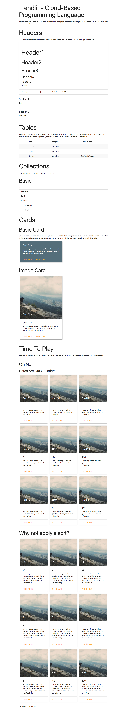

# Trendlit - Cloud-based Programming Language

## Setup
Make sure to install python3.7 and Docker. Also, don't forget to install trendlit's requirements:

`pip3 install -r requirements.txt `

## How To Run
It is almost as easy as pie. Just build the docker image by doing `make build`

Then simply do `make run`

If `http://localhost`  is up and running, we are golden.

## Main Semantic Characteristics
- There is only one script section.
- If script section is present, then it is defined at the top of the program. (before any html tag)
- Any variable defined in a script will be treated as a global variable.
- There can be n number of defined functions by the user.
- Any variable inside function in the script or embedded-script will be treated as a local variable.
- All variable names must be unique within a scope.
- There must be consistency between the defined type of a variable and the values it is assigned later on.

## Compilation Process
- In VERY general terms this is what happens after you finish writing your code in Trendlit.
- Lexer and Parser analyze your code !
- A semantic evaluation is done !
- Internal code is generated (Gimme those Quadz!)
- All your logic is sent to a virtual machine for processing!
- The results of your code are back from the virtual machine!
- You get a beautiful and usable HTML file to showcase in any browser !

We do a bunch of magic in the background, but the cool part is you don’t need to worry about any of that just focus on doing some fun stuff with Trendlit.

# What can I do with trendlit?


# Cool.. but how do I program in trendlit?
## Sample Code
This code is used for documentation. As a result, it should provide a sneak peak of all the cool stuff we just showed you.

```
program the_name_of_the_program

script {

  # This is a comment
  # VARIABLE AND DECLARATION AND INITIALIZATION SECTION
  # All Variables declared without an initial value are set to their zero values:
  # 0 for all integer types,
  # 0.0 for double point numbers,
  # False for bools,
  # "" for strings.

  # Primitives:
  int my_int
  str my_str
  bool my_bool
  double my_double

  # Slices: Are like arrays, but cooler:
  # int my_slice[10] = [] # Will initialize a slice with 10 zeros of type int

  # You can declare global variables like this.
  str global_var_name = "I am a global variable"

  # We support different data types and you can define them like this
  str name = "Ana Karen"
  int age = 23
  str sex = "F"
  double height = 1.6
  bool flag = True
  int i
  int card_counter = 9
  int arr_size = 9
  int aux_counter = 0
  int arr[10] = []

  # Also, you can do it this way!
  int d = 1, e = 2, f = 3

  # int my_slice2 [2] = [d, 3] # FAILURE EXAMPLE

  # End of declaration scope. Please do not declare variables beyond this point.

  # Assign value to slices
  arr[0] = 5
  arr[1] = -1
  arr[2] = 4
  arr[3] = 2
  arr[4] = -8
  arr[5] = 100
  arr[6] = -2
  arr[7] = 3
  arr[8] = 42
  # arr[11] = 100 # This should fail because it is out of bounds

  # CONDITIONALS

  # You can create a simple condition like the following
  # if(1>2){
  #   eval("True")
  # } else {
  #   eval("False")
  # }

  # Remember: Don't declare new vars outside the declaring scope.
  # int hola = 1 # FAILURE EXAMPLE

  # LOOPS
  # You can loop through an slice by using a loop
  # Note: This is a while disguised as a loop
  # loop (i not 10) {
  #     eval("Loop number: ", i)
  #     eval("")
  #     # Please don't declare any new variable inside a loop.
  #     # int hola = 1 # FAILURE EXAMPLE
  #     i = i + 1
  # }

  # MODULES
  # This is how you declare a function.
  # The group of parentheses is used for parametrization and whatever comes after the ':' the return type.
  # If the function is void, just ignore the ':' and the return type
  # You can use the spit statement to return your values

  # This is how you declare a non-spitting function (aka void)
  def print_array (int size_array) {
      int i = 0, j=0
      loop(i < size_array) {
          eval(arr[i])
          i = i + 1
        }
       i = 0
  }
  # This function returns a bool!
  def my_find(int num) : bool {
      int i # This is a local variable
      bool result # This is a local variable
      loop(i < arr_size)  {
          if(arr[i] is num){
              result = True
              spit result
          }
          # int result = a + b # FAILURE EXAMPLE
          i = i + 1
      }

      spit result
  }

  def bubble_sort(int array_size) {
    int i = 0, j=0, temp = 0

        loop(i < array_size - 1) {
            loop(j < array_size - i - 1) {
                if (arr[j] > arr[j+1]) {
                    temp = arr[j]
                    arr[j] = arr[j+1]
                    arr[j+1] = temp
                }
                j = j+1
            }
            j = 0
            i = i+1
        }
        i = 0
        }
    }

# Quick start with a prettifier!
head class : "pretty" {}


div class : "container" {

h1 { <^ "Trendlit - Cloud-Based Programming Language" ^> }


p {
    <^ "The container class is set to ~70% of the window width.
    It helps you center and contain your page content.
    We use the container to contain our body content." ^>
  }

  h1 { <^ "Headers" ^> }
  p {
      <^ "We provide some basic styling on header tags. In the example, you can
      see the the 6 header tags' different sizes."^>
  }

  div class : "card-panel" {
      h1 { <^ "Header1" ^> }
      h2 { <^ "Header2" ^> }
      h3 { <^ "Header3" ^> }
      h4 { <^ "Header4" ^> }
      h5 { <^ "Header5" ^> }
      h6 { <^ "Header6" ^> }
  }

  p class : "my-class" {
    <^ "Whatever goes inside this hats (<^ ^>) will be evaluated as a code." ^>
    <^ 30 + 30 ^> # This will be evaluated as code
  }
  div class : "divider" {}
  div class : "section" {
    h5 { <^ "Section 1" ^> }
    p { <^ "Stuff" ^> }
  }

  div class : "divider" {}
  div class : "section" {
    h5 { <^ "Section 2" ^> }
    p { <^ "More Stuff" ^> }
  }

  h1 { <^ "Tables" ^> }
  p {
    <^ "Tables are a nice way to organize a lot of data.
    We provide a few utility classes to help you style
    your table as easily as possible. In addition, to improve
    mobile experience, all tables on mobile-screen widths
    are centered automatically." ^>
  }

  table class : "striped centered" {
    thead {
      tr {
        th {
          <^ "Name" ^>
        }
        th {
          <^ "Subject" ^>
        }

        th {
          <^ "Final Grade" ^>
        }
      }
    }

    tbody {
      tr {
        td {
          <^ "Ana Karen"^>
        }
        td {
          <^ "Compilers"^>
        }
        td {
          <^ "100"^>
        }
      }
      tr {
        td {
          <^ "Sergio"^>
        }
        td {
          <^ "Compilers"^>
        }
        td {
          <^ "100"^>
        }
      }
      tr {
        td {
          <^ "Hernan"^>
        }
        td {
          <^ "Compilers"^>
        }
        td {
          <^ "See You In August"^>
        }
      }
    }
  }

  h1 { <^ "Collections" ^> }

  p { <^ "Collections allow you to group list objects together." ^> }

  h2 { <^ "Basic" ^> }

  p { <^ "Unordered list: " ^> }

  ul class : "collection" {
    li class : "collection-item" {
        <^ "Ana Karen" ^>
    }
    li class : "collection-item" {
        <^ "Sergio" ^>
    }
  }
  p { <^ "Ordered list: " ^> }

  ol class : "collection" {
    li class : "collection-item" {
      <^ "Ana Karen" ^>
    }
    li class : "collection-item" {
      <^ "Sergio" ^>
    }
  }

  h1 { <^ "Cards" ^> }
  h2 { <^ "Basic Card" ^> }
  p {
    <^ "Cards are a convenient means of displaying content composed of different
     types of objects. They’re also well-suited for presenting similar objects
     whose size or supported actions can vary considerably,
     like photos with captions of variable length." ^>
  }

  div class : "row" {
    div class : "col s12 m6" {
      div class : "card blue-grey darken-1" {
        div class : "card-content white-text" {
          span class : "card-title" {
            <^"Card Title"^>
          }
          p {
            <^ "I am a very simple card. I am good at containing small bits of information." ^>
            <^ "I am convenient because I require little markup to use effectively." ^>
          }
        }

        div class : "card-action" {
         link href : "#" {<^"This is a link"^>}
         link href : "#" {<^"This is a link"^>}
        }
      }
    }
  }

    h2 { <^ "Image Card" ^> }
        div class : "row" {
            div class : "col s12 m6" {
                div class : "card " {
                    div class : "card-image" {
                        img src : "https://picsum.photos/400/400" {}
                        span class : "card-title" { <^"Card Title"^> }
                    }
                    div class : "card-content" {
                    span class : "card-title" { <^"Card Title"^> }
                    p {
                        <^ "I am a very simple card. I am good at containing small bits of information." ^>
                        <^ "I am convenient because I require little markup to use effectively." ^>
                    }
                }

                div class : "card-action" {
                    link href : "#" {<^"This is a link"^>}
                    link href : "#" {<^"This is a link"^>}
                }
            }
        }
    }

    h1 {<^ "Time To Play" ^>}

    p {<^" Now that we saw how to use trendlit, we can combine
       the gathered knowledge to generte dynamic html using user-declared
       functions.
       "^>}
    h3 { <^ "Oh No!" ^> }
    h4 {<^ "Cards Are Out Of Order!" ^>}
      div class : "row" {
      <% loop (aux_counter < card_counter) %>
        div class : "col m4" {
          div class : "card " {
            div class : "card-image" {
              img src : "https://picsum.photos/400/400" {}
              span class : "card-title" {
                <^ "Card" ^>
                <^ arr[aux_counter] ^>
              }
            }
            div class : "card-content" {
                span class : "card-title" {
                  <^ arr[aux_counter] ^>
                }
              p {
                <^ "I am a very simple card. I am good at containing small bits of information." ^>
              }
            }
            div class : "card-action" {
             link href : "#" {<^"This is a link"^>}
            }
          }
        }
        <% aux_counter = aux_counter + 1 %>
        <% end %>
      }
    h2 {<^ "Why not apply a sort?" ^>}

    <% aux_counter = 0 %> # Reset counter
    <% bubble_sort(arr_size) %> #calls bubble sort function defined in script

    div class : "row" {
    <% loop (aux_counter < card_counter) %>
      div class : "col m4" {
        div class : "card " {
          div class : "card-image" {
            img src : "https://picsum.photos/400/400" {}
            span class : "card-title" {
              <^ arr[aux_counter] ^>
            }
          }
          div class : "card-content" {
            span class : "card-title" {
              <^ arr[aux_counter] ^>
            }
            p {
              <^ "I am a very simple card. I am good at containing small bits of information." ^>
              <^ "I am convenient because I require little markup to use effectively." ^>
            }
          }
          div class : "card-action" {
           link href : "#" {<^"This is a link"^>}
          }
        }
      }
      <% aux_counter = aux_counter + 1 %>
      <% end %>
    }
    h6 { <^ "Cards are now sorted! ;)" ^> }

}
```
